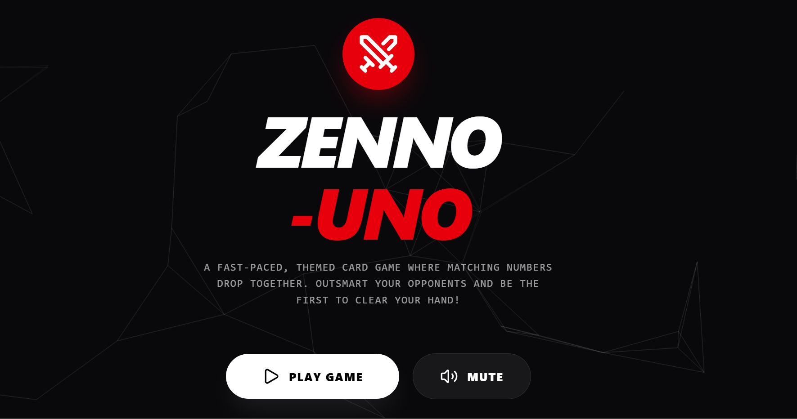

# ZENNO UNO GAME

A fast-paced, themed card game where matching numbers drop together.  
Outsmart your opponents and be the first to clear your hand!

[▶ Play Game](https://axle-17.github.io/zenno-uno-game/) | 🔇 Mute

This contains everything you need to run your app locally.

## Run Locally

**Prerequisites:**  Node.js

1. Install dependencies:
   `npm install`
2. Set the `API_KEY` in [.env.local](.env.local) to your API key
3. Run the app:
   `npm run dev`
#
